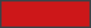
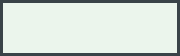
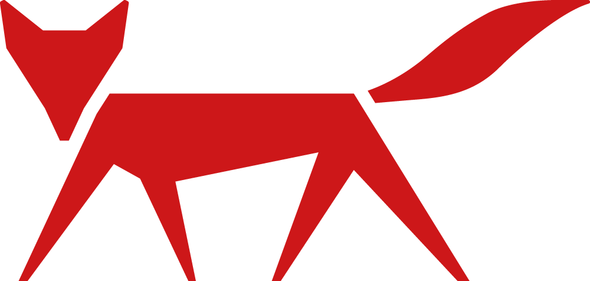
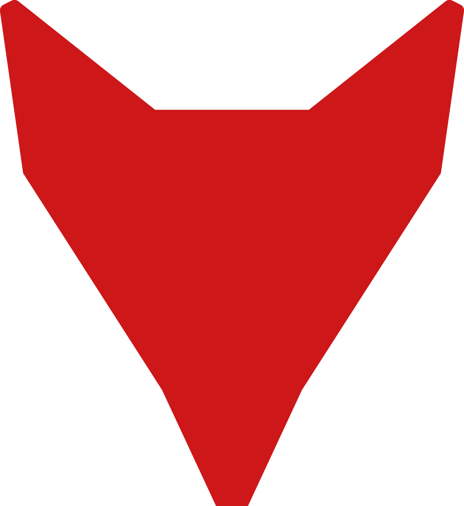

<picture>
  <source media="(prefers-color-scheme: dark)" srcset="assets/logo-claim-negativ.png">
  
</picture>

  

**Systemlösungen für den Fensteranschluss.** 
Aus Mengerskirchen in ganz Europa.

 

 

## Beck+Heun

Beck+Heun entwickelt und produziert Systemlösungen rund um den Fensteranschluss –
von Rollladen- und Raffstorekästen über Dämm- und Anschlusssysteme bis zu Zubehör
für die energetische Sanierung. Unsere Produkte verbinden Bauphysik, Wärmeschutz
und Montagefreundlichkeit: dort, wo Fenster und Mauerwerk aufeinandertreffen und
über Energieeffizienz, Schallschutz und Luftdichtheit entschieden wird.

Unser Anspruch steht im Claim: **beste Werte fürs Haus** – bauphysikalisch messbar
und im Alltag spürbar.

<!--
TODO Marketing: Absatz gegen die aktuelle Unternehmensdarstellung auf beck-heun.de
abgleichen (Produktbereiche, Positionierung, ggf. Gründungsjahr, Standorte,
Mitarbeiterzahl, Zertifizierungen). Bewusst ohne Zahlen gehalten, solange nicht
freigegeben.
-->

 

## Was du hier findest

Diese GitHub-Organisation ist der technische Teil von Beck+Heun. Hier bündeln wir,
was rund um unsere Produkte digital entsteht:

| Bereich | Inhalt |
|---|---|
| **Produktdaten & Schnittstellen** | Datenformate und Exporte für Planung, Kalkulation und Fachhandel |
| **Planungs- & Konfigurations-Tools** | Werkzeuge, die Architekt:innen, Planer:innen und Verarbeiter:innen die Auswahl erleichtern |
| **Interne Automatisierung** | Skripte und Services, die Prozesse in Produktion, Vertrieb und Verwaltung verbinden |
| **Marke & Vorlagen** | Corporate Design, Logo-Dateien und wiederverwendbare Vorlagen |

<!--
TODO: Tabelle an die real geplanten Themen anpassen. Zeilen, die (noch) nicht
zutreffen, einfach löschen – eine kurze, wahre Liste wirkt besser als eine lange,
die Erwartungen weckt.
-->

 

## Projekte

<!--
TODO: Ausgewählte Repositories eintragen, sobald vorhanden. Öffentliche Profile
zeigen nur öffentliche Repos – private Projekte hier bitte nicht verlinken.
-->

| Repository | Beschreibung | Status |
|---|---|---|
| – | Noch keine öffentlichen Repositories. | – |

Du suchst eine bestimmte Schnittstelle oder ein Datenformat?
Schreib uns – siehe [Kontakt](#kontakt).

 

## Zusammenarbeit

Wir arbeiten mit Fachpartnern, Softwarehäusern und Dienstleistern zusammen.
Für die Arbeit in dieser Organisation gilt:

- **Fragen und Fehler** gehören in die Issues des jeweiligen Repositories.
- **Änderungen** kommen als Pull Request auf einem eigenen Branch – mit kurzer
  Beschreibung, was sich fachlich ändert.
- **Keine sensiblen Daten** in Repositories, Issues oder Commits: keine
  Personen- oder Kundendaten, keine Preis- oder Bankdaten, keine Zugangsdaten.
  Öffentliche Repositories sind dauerhaft öffentlich – auch nach einem `git revert`.
- **Marke und Design** folgen dem Corporate Design (siehe unten). Eigenmächtig
  veränderte Logo-Dateien sind nicht zulässig.

 

## Marke

Unser Erscheinungsbild ist im Corporate Design Manual festgelegt. Die Kurzfassung
für digitale Anwendungen:

<table>
  <tr>
    <td></td>
    <td><b>Beck+Heun Grün</b> <code>#BCD5BF</code></td>
    <td></td>
    <td><b>Beck+Heun Rot</b> <code>#CD1719</code></td>
  </tr>
  <tr>
    <td></td>
    <td><b>Beck+Heun Hellgrün</b> <code>#EBF5EC</code></td>
    <td></td>
    <td><b>Beck+Heun Blau</b> <code>#004D9D</code></td>
  </tr>
  <tr>
    <td></td>
    <td><b>Beck+Heun Grau</b> <code>#394348</code></td>
    <td></td>
    <td><b>Schwarz</b> <code>#000000</code></td>
  </tr>
</table>

Die beiden Grüntöne sind unsere Primärfarben und tragen jede plakative Fläche.
Rot und Blau bleiben der Wortbildmarke vorbehalten, Grau ist die Farbe der
Piktogramme und der Fließtexte.

**Schrift:** Klint Pro als Hausschrift, Calibri für Office-Anwendungen.

**Logo-Varianten** – Details, Mindestgrößen und Abstände in
[`brand.md`](brand.md):

<table>
  <tr>
    <td align="center" width="25%">
      <picture>
        <source media="(prefers-color-scheme: dark)" srcset="assets/logo-claim-negativ.png">
        
      </picture>
       Wortbildmarke mit Claim
    </td>
    <td align="center" width="25%">
      <picture>
        <source media="(prefers-color-scheme: dark)" srcset="assets/wortbildmarke-negativ.png">
        
      </picture>
       Wortbildmarke
    </td>
    <td align="center" width="25%">
      <picture>
        <source media="(prefers-color-scheme: dark)" srcset="assets/bildmarke-negativ.png">
        
      </picture>
       Bildmarke
    </td>
    <td align="center" width="25%">
      <picture>
        <source media="(prefers-color-scheme: dark)" srcset="assets/fuchskopf-negativ.png">
        
      </picture>
       Fuchskopf
    </td>
  </tr>
</table>

 

## Kontakt

**Beck+Heun GmbH** 
Reinhold-Beck-Straße 2 · 35794 Mengerskirchen · Deutschland 
[beck-heun.de](https://www.beck-heun.de)

Fragen zu dieser Organisation, zu Schnittstellen oder zur Nutzung unserer
Markenzeichen gehen an die zuständige Fachabteilung über das
[Kontaktformular](https://www.beck-heun.de) auf unserer Website.

<!--
TODO: Falls es funktionsbezogene Postfächer gibt (z. B. marketing@…, it@…),
diese hier eintragen. Bitte keine persönlichen Namen oder personenbezogenen
E-Mail-Adressen auf einer öffentlichen Seite.
-->

 

 

© Beck+Heun GmbH · Logos und Wortmarken sind geschützt.

